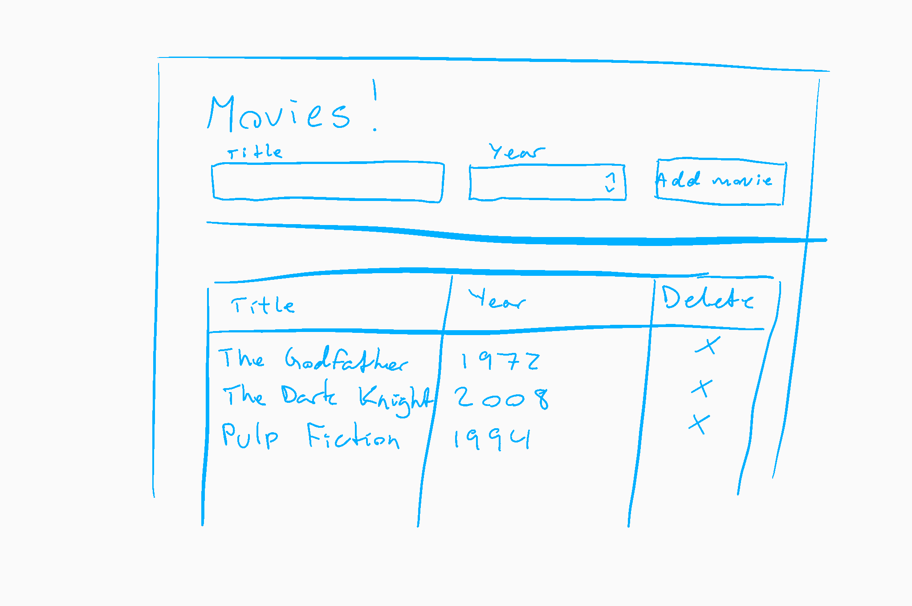

# Oppgave 1: Hello, world!

Du skal bygge en webapplikasjon som holder styr på en liste med ting du liker. For eksempel kan du lage en oversikt over populære telefonmodeller siden 2000, eller filmer du har lyst til å se.

I tillegg skal du kort drøfte to spørsmål.

## Kodeprosjekt

Du skal lage en applikasjon ved hjelp av følgende komponenter:

- Node.js (med Express som webserver)
- MongoDB (med Mongoose som ODM i Node-applikasjonen)
- React (hvor applikasjonen er generert av create-react-app)

Det skal legges ved en kortfattet rapport med:

- Skjermbilde av den fungerende løsningen
- Kommentar dersom noen ting ikke fungerer (og hva du tror er galt)
- Eventuelle valg og forutsetninger du har tatt
- Synliggjøring og eventuell forklaring av spesielle, særskilt elegante, eller på annet vis ukonvensjonelle løsninger
- En kort forklaring av hvordan applikasjonen startes lokalt
- Begrunnelse for valg av URL-struktur og HTTP-verb

Vurderingen vektlegger generell kodekvalitet, god praksis, og semantikk. Et eksempel på dette er API-ets design i henhold til REST-paradigmets URL-struktur og HTTP-verb. Grafisk design og brukeropplevelse er _ikke_ vurderingsgrunnlag; det oppfordres til å benytte et CSS-rammerverk som Bootstrap 3.

### Kravspesifikasjon

- Applikasjonen trenger kun å fungere lokalt (vurdering vil skje mot lokal database).
- Webapplikasjonen skal bestå av én side.
- Når webapplikasjonen lastes i nettleseren, skal den hente alle eksisterende elementer fra Node-serveren ved hjelp av et HTTP-kall med `fetch`. Node-serveren skal igjen laste disse fra databasen.
- Det skal finnes et skjema på siden for å legge inn nye elementer (og nye elementer skal reflekteres i databasen).
- Det skal være mulig å slette et element fra lista (som skal reflekteres i databasen).
- Lista skal oppdateres automatisk (uten behov for refresh) når brukeren legger til eller sletter et element.

Applikasjonen kan for eksempel se ut som følger:

### Bonusoppgaver

- Kjør ESLint på kodebasen kommenter hva den plukket opp i rapporten. Var det noen fordeler eller ulemper ved å bruke ESLint i dette prosjektet?
- Gjør det mulig å søke i (filtrere) lista i webapplikasjonen (se https://developer.mozilla.org/en-US/docs/Web/JavaScript/Reference/Global_Objects/Array/filter og https://developer.mozilla.org/en-US/docs/Web/JavaScript/Reference/Global_Objects/String/includes).

## Drøfting

Du skal relativt kortfattet drøfte følgende tre spørsmål. Besvarelsen bør totalt ligge rundt 300 ord.

1. Hva er noen fordeler og ulemper ved å benytte en stack bygget på kun JavaScript?
2. Hva er et (web-)API, og hva er noen fordeler og ulemper ved å lage et? Når bør man _ikke_ lage et API?

## Praktisk informasjon

- Eventuelle spørsmål kan stilles i forumet på It's Learning, via melding på It's Learning, eller per e-post til martin@lehmann.tech.
- Du kan levere en besvarelse senest søndag 1. oktober 2017 klokka 23:59 for å få en grov poengvurdering og skriftlig tilbakemelding. Det oppfordres sterkt til å benytte denne ordningen.
- Siste frist for innlevering av siste versjon av alle oppgaver i emnet er 10. desember 2017 klokka 23:59.
- Besvarelsen skal bestå av en zip-fil (eller tilsvarende arkiv) som inneholder kildekode (men ikke node_modules/), samt den vedlagte rapporten og drøftingen.
