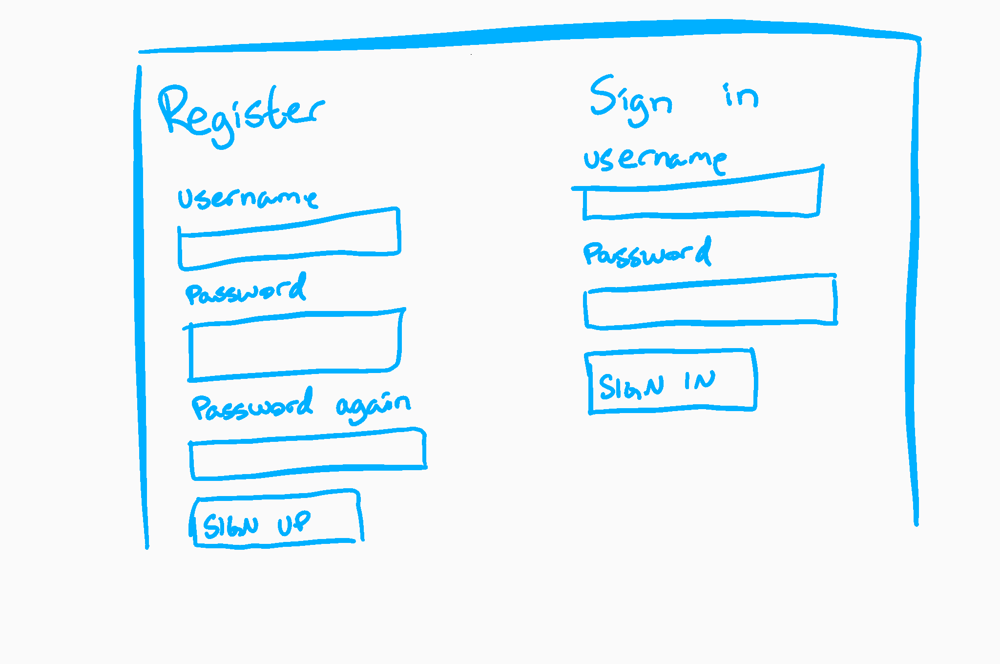
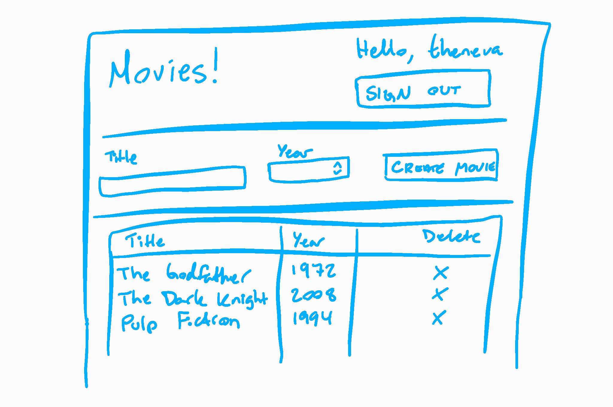
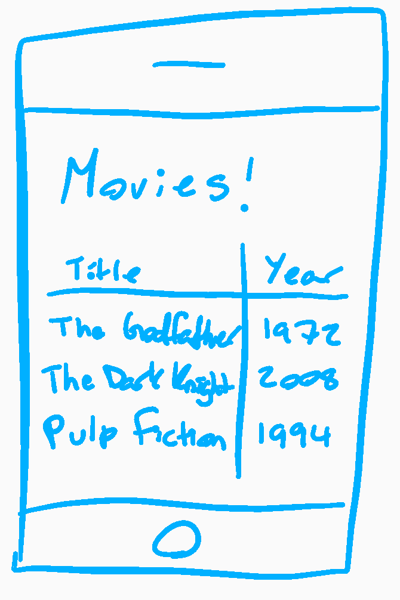

# Oppgave 2: A useful app!

Du skal bygge et system som lar brukere holde styr på en personlig liste med ting de selv liker. For eksempel kan de lage en oversikt over populære telefonmodeller siden 2000, eller filmer de har lyst til å se.

Denne oppgaven bygger direkte videre på oppgave 1, og inneholder dermed alle kravene fra oppgave 1. Nytt i oppgave 2 er autentisering og brukeres personlige lister, samt krav om mobilapplikasjon.

I tillegg skal du kort drøfte to spørsmål.

## Kodeprosjekt

Du skal lage et system ved hjelp av følgende komponenter:

- API: Node.js (med Express som webserver)
- Database: MongoDB (med Mongoose som ODM i Node-applikasjonen)
- Webside: React (hvor applikasjonen er generert av create-react-app)
- Mobilapplikasjon: React Native

Det skal legges ved en kortfattet rapport med:

- Skjermbilde av den fungerende løsningen fra web og mobil
- Kommentar dersom noen ting ikke fungerer (og hva du tror er galt)
- Eventuelle valg og forutsetninger du har tatt
- Synliggjøring og eventuell forklaring av spesielle, særskilt elegante, eller på annet vis ukonvensjonelle løsninger
- En kort forklaring av hvordan applikasjonene (API-et, websiden, og mobil-appen) startes lokalt
- Begrunnelse for valg av URL-struktur og HTTP-verb

Vurderingen vektlegger generell kodekvalitet, god praksis, og semantikk. Et eksempel på dette er API-ets design i henhold til REST-paradigmets URL-struktur og HTTP-verb. Grafisk design og brukeropplevelse er _ikke_ vurderingsgrunnlag; det oppfordres til å benytte et CSS-rammerverk som Bootstrap 3.

### Kravspesifikasjon

En bruker av systemet skal kunne gjøre følgende.

__På web__

- Fra innloggingssiden
    - Registrere seg som ny bruker med (minst) brukernavn og passord
    - Logge inn som eksisterende bruker, og tas videre til siden med brukerens personlige liste
    - Se feilmelding dersom noe går galt, minimum:
        - Registrering
            - Brukernavnet er allerede tatt
            - Passordet må være minst 4 tegn
        - Innlogging
            - Brukernavnet finnes ikke, eller passordet er feil
        - Generelt
            - Nettverkstilkobling til API-et feilet
            - Noe annet gikk galt på serversiden
- Fra listevisningen
    - Umiddelbart se alle elementer brukeren selv har opprettet
    - Opprette nye elementer (som legges inn i lista uten at siden lastes på nytt)
    - Slette elementer (som fjernes fra lista uten at siden lastes på nytt)
    - Se brukernavnet til den innloggede brukeren
    - Logge ut og tas tilbake til innloggingssiden

__På mobil__

- Se lista til en enkelt bruker (her er det _ikke_ krav om å implementere innlogging; det er lov til å hardkode et token i appen)

__Generelt__

- En bruker skal kun ha tilgang til å lese og slette elementer brukeren selv har opprettet

Webapplikasjonen kan for eksmpel ha følgende to sider.

{ width=75% }

{ width=75% }

Mobilapplikasjonen kan se ut som følger:

{ width=50% }

### Bonusoppgaver

- Gjør det mulig å filtrere søke i (filtrere) lista i webapplikasjonen (for eksempel et tekstfelt der brukeren kan skrive inn et søkeord, hvorpå lista oppdaterer seg til å kun vise frem elementer som matcher søkeordet)
- Gjør det mulig å slette elementer fra mobilapplikasjonen
- Gjør det mulig å logge inn som andre brukere i mobilapplikasjonen (i stedet for å hardkode et token)

## Drøfting

Du skal relativt kortfattet drøfte følgende to spørsmål. Besvarelsen bør totalt ligge rundt 300 ord.

1. Hva er noen fordeler og ulemper ved å sende et token (som JSON Web Token) via en HTTP-header (som Authorization) kontra å bruke en Cookie?
2. Hva er hensikten med REpresentational State Transfer (REST)? Hva er noen fordeler og ulemper med å implementere nivå 2 og 3 av REST i Richardson Maturity Model?

## Praktisk informasjon

- Applikasjonen trenger kun å fungere lokalt (vurdering vil skje mot lokal database).
- Eventuelle spørsmål kan stilles i forumet på It's Learning, via melding på It's Learning, eller per e-post til martin@lehmann.tech.
- Du kan levere en besvarelse senest onsdag 1. november 2017 klokka 23:59 for å få en grov poengvurdering og skriftlig tilbakemelding. Det oppfordres sterkt til å benytte denne ordningen.
- Siste frist for innlevering av siste versjon av alle oppgaver i emnet er 10. desember 2017 klokka 23:59.
- Besvarelsen skal bestå av en zip-fil (eller tilsvarende arkiv) som inneholder kildekode (men ikke node_modules/), samt den vedlagte rapporten og drøftingen.
