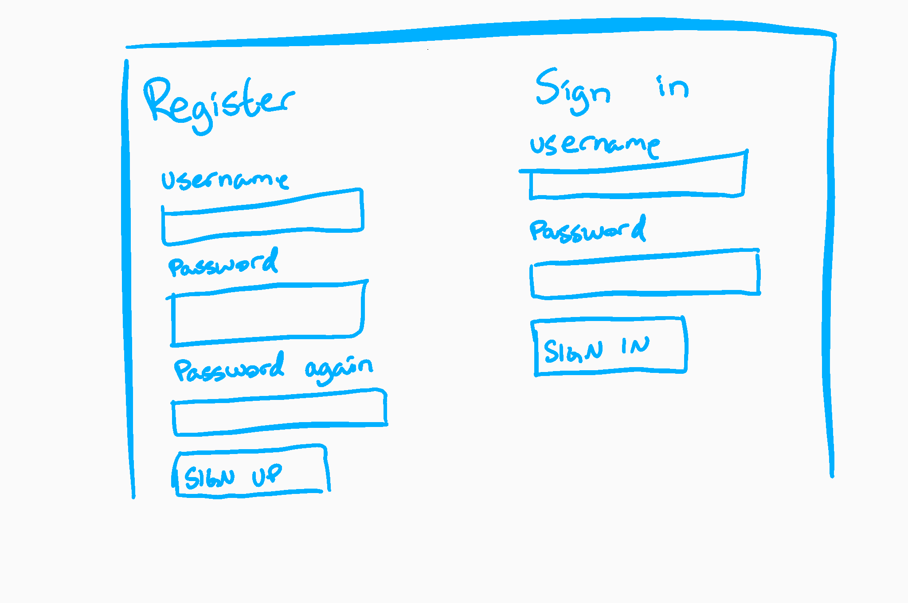
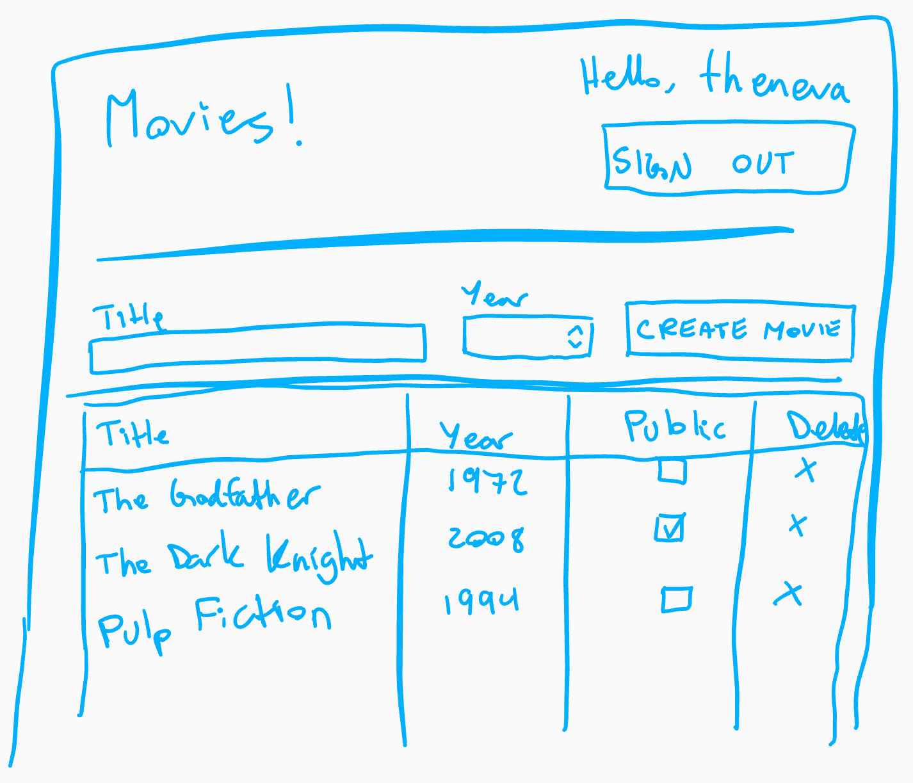
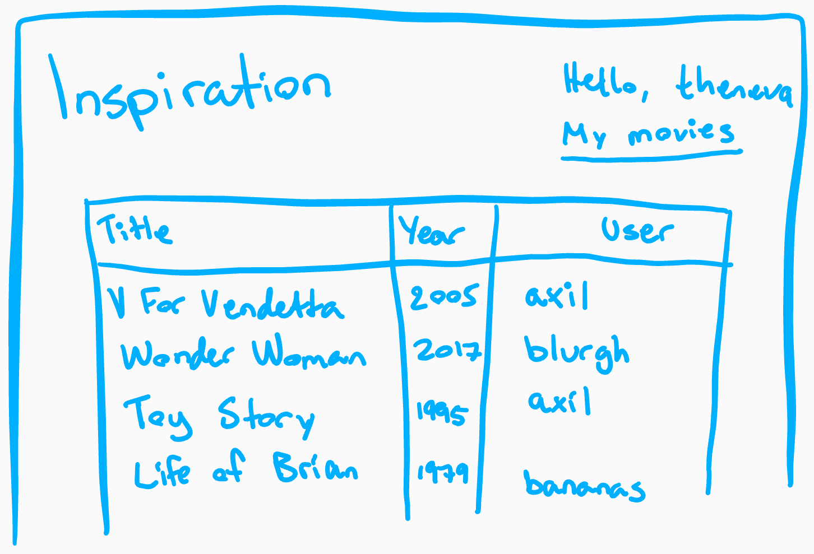
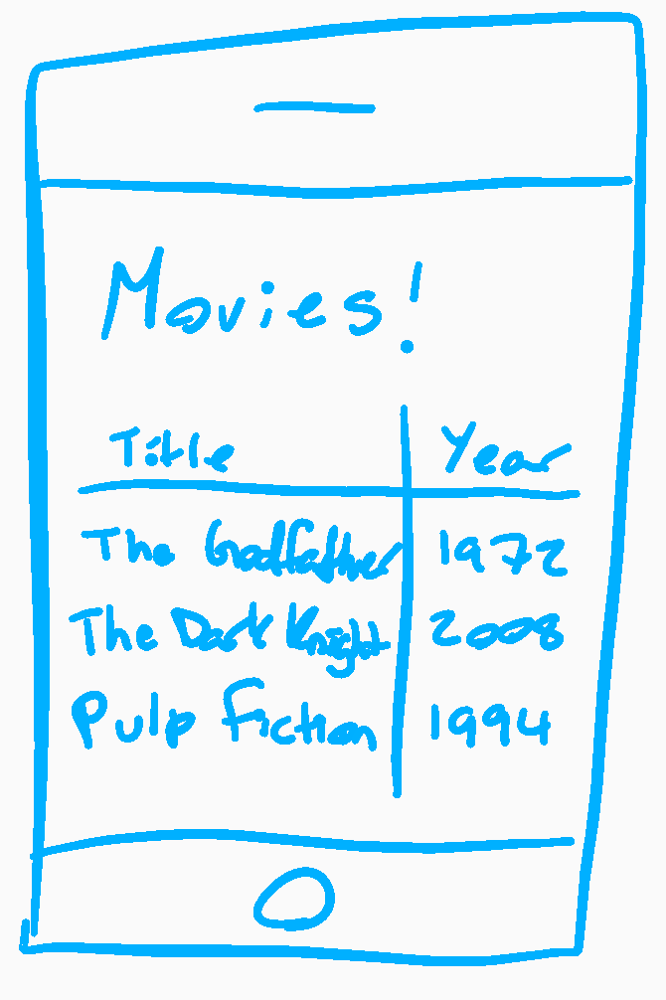

# Oppgave 3: Actual working software

Du skal bygge et system som lar brukere holde styr på en personlig liste med ting de selv liker. For eksempel kan de lage en oversikt over populære telefonmodeller siden 2000, eller filmer de har lyst til å se.

Denne oppgaven bygger direkte videre på oppgave 2, og inneholder dermed alle kravene fra oppgave 2. Nytt i oppgave 3 er bruk av WebSockets og krav om testdekning, samt pakking av serveren i en Docker-container.

I tillegg skal du kort drøfte to spørsmål.

## Kodeprosjekt

Du skal lage et system ved hjelp av følgende komponenter:

- API: Node.js (med Express som webserver)
- Database: MongoDB (med Mongoose som ODM i Node-applikasjonen)
- Webside: React (hvor applikasjonen er generert av create-react-app)
- Mobilapplikasjon: React Native

Det skal legges ved en kortfattet rapport med:

- Skjermbilde av den fungerende løsningen fra web og mobil
- Kommentar dersom noen ting ikke fungerer (og hva du tror er galt)
- Eventuelle valg og forutsetninger du har tatt
- Synliggjøring og eventuell forklaring av spesielle, særskilt elegante, eller på annet vis ukonvensjonelle løsninger
- En kort forklaring av hvordan applikasjonene (API-et, websiden, og mobil-appen) startes lokalt
- Begrunnelse for valg av URL-struktur og HTTP-verb
- Kommentarer om hvilke deler av applikasjonen du har valgt å teste, og hvorfor.

Vurderingen vektlegger generell kodekvalitet, god praksis, og semantikk. Et eksempel på dette er API-ets design i henhold til REST-paradigmets URL-struktur og HTTP-verb. Grafisk design og brukeropplevelse er _ikke_ vurderingsgrunnlag; det oppfordres til å benytte et CSS-rammeverk som Bootstrap 3.

\newpage

### Kravspesifikasjon

En bruker av systemet skal kunne gjøre følgende.

__På web__

- Fra innloggingssiden
    - Registrere seg som ny bruker med (minst) brukernavn og passord
    - Logge inn som eksisterende bruker, og tas videre til siden med brukerens personlige liste
    - Se feilmelding dersom noe går galt, minimum:
        - Registrering
            - Brukernavnet er allerede tatt
            - Passordet må være minst 4 tegn
        - Innlogging
            - Brukernavnet finnes ikke, eller passordet er feil
        - Generelt
            - Nettverkstilkobling til API-et feilet
            - Noe annet gikk galt på serversiden
- Fra listevisningen
    - Umiddelbart se alle elementer brukeren selv har opprettet
    - Endre private elementer til offentlige, eller offentlige elementer til private
    - Opprette nye elementer (som legges inn i lista uten at siden lastes på nytt)
    - Slette elementer (som fjernes fra lista uten at siden lastes på nytt)
    - Se brukernavnet til den innloggede brukeren
    - Logge ut og tas tilbake til innloggingssiden
- Fra inspirasjonssiden
    - Se en liste med de 10 sist endrede offentlige elementene laget av andre brukere
    - Lista skal automatisk oppdateres når andre brukere gjør sine elementer offentlige eller private
    - Se brukernavnet til den innloggede brukeren
    - Se en lenke tilbake til sin egen personlige listevisning

__På mobil__

- Se lista til en enkelt bruker (her er det _ikke_ krav om å implementere innlogging; det er lov til å hardkode et token i appen)

__Generelt__

- En bruker skal kun ha tilgang til å lese og slette elementer brukeren selv har opprettet, pluss elementer andre brukere har gjort offentlige.

\newpage

Webapplikasjonen kan for eksempel ha følgende tre sider.

{ width=75% }

{ width=75% }

{ width=75% }

Mobilapplikasjonen kan se ut som følger:

{ width=50% }

### Bonusoppgaver

- Gjør det mulig å filtrere søke i (filtrere) lista i webapplikasjonen (for eksempel et tekstfelt der brukeren kan skrive inn et søkeord, hvorpå lista oppdaterer seg til å kun vise frem elementer som matcher søkeordet)
- Gjør det mulig å slette elementer fra mobilapplikasjonen
- Gjør det mulig å logge inn som andre brukere i mobilapplikasjonen (i stedet for å hardkode et token)
- Lagre applikasjonens tilstand i Redux, og kommenter i rapporten hvilke fordeler og ulemper dette bringer med seg.

## Tekniske krav

- Node-serveren (API-et) skal pakkes i en Docker-container for å være klar for å deployes. Dette betyr at prosjektet skal inneholde en Dockerfile, og det skal være mulig å kjøre kommandoen `docker build -t the-api .` for å bygge imaget. Deretter skal det være mulig å kjøre serveren med `docker run -P the-api`. Eventuelle parametre eller argumenter som må til for å starte serveren skal dokumenteres i rapporten. Det er _ikke_ nødvendig å servere React-applikasjonen fra Docker-containeren.
- Det skal finnes automatiserte tester (skrevet med Jest) for de delene av applikasjonen du mener det er hensiktsmessig å teste. Testene skal kunne kjøres med `yarn test` eller `npm run test`. Begrunn hva du har valgt å skrive tester for i rapporten.

## Drøfting

Du skal relativt kortfattet drøfte følgende to spørsmål. Besvarelsen bør totalt ligge rundt 300 ord.

1. Hva er hensikten med å automatisere testing av en fullstack webapplikasjon? Hvis du måtte velge mellom å skrive unit-tester, integrasjonstester, og end-to-end-tester, hvilken type test ville du valgt å skrive for prosjektet? Hvorfor?
2. Hva er fordeler og ulemper ved å bruke WebSockets? Når bør man _ikke_ bruke dem?

## Praktisk informasjon

- Applikasjonen trenger kun å fungere lokalt (vurdering vil skje mot lokal database).
- Eventuelle spørsmål kan stilles i forumet på It's Learning, via melding på It's Learning, eller per e-post til martin@lehmann.tech.
- Du kan levere en besvarelse senest onsdag 26. november 2017 klokka 23:59 for å få en grov poengvurdering og skriftlig tilbakemelding. Det oppfordres sterkt til å benytte denne ordningen.
- Siste frist for innlevering av endelig leveranse 10. desember 2017 klokka 23:59; se egen oppgavetekst for denne.
- Besvarelsen skal bestå av en zip-fil (eller tilsvarende arkiv) som inneholder kildekode (men ikke node_modules/), samt den vedlagte rapporten og drøftingen.
